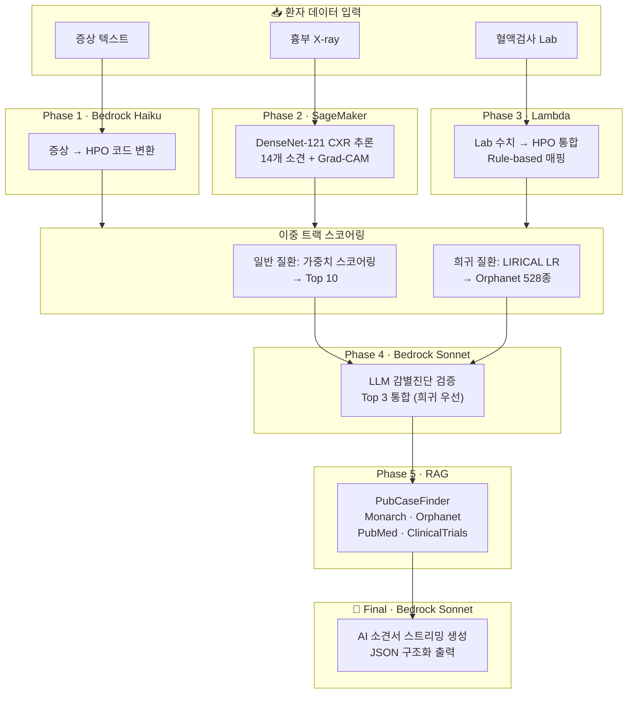

<div align="center">


# 🫁 Soo-Pul (SooNet-Pulmonary)

### **희귀 폐질환 임상 의사결정 지원 시스템**
*Clinical Decision Support for Rare Pulmonary Disease*

<br/>

[](https://d300v14l8u0wx7.cloudfront.net/?demo=1)
[](https://ap-northeast-2.console.aws.amazon.com/s3/home?region=ap-northeast-2)
[](https://github.com/heotaewoong/aws_say2_project)
[](./aws_say2_project_vision)
[](./2_aws_say2_project_cloudfront/frontend)
[](./aws_say2_project_vision/scripts)

<br/>

> **흉부 X-ray + 증상 + 혈액검사 + 유전 정보**를 통합 분석하여  
> 의사에게 **근거 기반 진단 보고서**를 자동 생성하는 멀티모달 AI 시스템

</div>

---

## 📋 목차

- [라이브 데모](#-라이브-데모)
- [주요 기능 미리보기](#-주요-기능-미리보기)
- [시스템 아키텍처](#-시스템-아키텍처)
- [AI 파이프라인 (Phase 1~5)](#-ai-파이프라인-phase-15)
- [모델 성능](#-모델-성능)
- [AWS 서비스](#️-aws-서비스)
- [기술 스택](#-기술-스택)
- [프로젝트 구조](#-프로젝트-구조)
- [로컬 실행](#-로컬-실행)
- [참고 문헌](#-핵심-참고-문헌)
- [팀](#-팀)
- [면책 조항](#️-면책-조항)

---

## 🔗 라이브 데모

<div align="center">

### 👉 **[https://d300v14l8u0wx7.cloudfront.net](https://d300v14l8u0wx7.cloudfront.net/?demo=1)**

*브라우저에서 바로 실행 · 설치 불필요 · AWS CloudFront 글로벌 배포*

</div>

---

## 🖥 주요 기능 미리보기

### 1️⃣ 로그인 & 환자 워크리스트

<div align="center">

<p><em>SMART on FHIR SSO 기반 병원 통합 인증 로그인 화면</em></p>
</div>

<br/>

<div align="center">

<p><em>환자 워크리스트 — 당일 외래 30명, AI 분석 상태 실시간 추적</em></p>
</div>

<br/>

- **SMART on FHIR SSO** 기반 병원 통합 인증
- 당일 외래 환자 목록 실시간 표시 (30명)
- **즉각 조치 필요** 패널: 희귀질환 의심 · Don't miss 알림
- **AI 분석 완료 미확인** 패널: 결과 검토 대기 환자 표시
- AI 분석 상태별 필터: `전체 30` · `당일 외래 10` · `예약 4` · `최근 진료 16`
- 하단 워크리스트: CXR · AI · LAB · EMR 연동 상태 아이콘 · 희귀질환 플래그

---

### 2️⃣ EMR 연동 & AI 분석 시작

<div align="center">

<p><em>EMR Integration — SMART on FHIR 기반 환자 데이터 자동 수집 화면</em></p>
</div>

<br/>

환자를 선택하면 EMR 연동 화면이 표시됩니다:
- **환자 기본 정보**: 이름 · MRN · 나이 · 성별 · 알러지
- **활력 징후**: BP · HR · RR · SpO₂ · Temp
- **검사 결과**: CBC · Chem · ABG · Inflammation
- **흉부 X-ray**: DICOM → 448 resized · 영상의학과 판독
- **임상 노트**: Chief complaint · HPI · 진찰소견
- **⚡ EMR에서 환자 정보 불러오기** 클릭 → 모든 데이터 수집 후 AI 분석 자동 시작

---

### 3️⃣ AI 진단 워크스페이스 (3-Panel 뷰)

<div align="center">

<p><em>AI 진단 워크스페이스 — 좌: 임상 데이터 / 중앙: CXR + Grad-CAM / 우: 감별진단 · Phase 진행</em></p>
</div>

<br/>

데이터 수집 완료 후 **Phase 1→5 자동 실행**과 함께 3-Panel 분석 뷰가 열립니다:

| 패널 | 기능 |
|------|------|
| **좌측 (Panel #1)** | 입력 요약 — 주호소 · HPO 코드 · 활력징후 · Lab Highlights · Phase Progress |
| **중앙 (Panel #2)** | CXR 원본 + **Grad-CAM 히트맵** 비교 뷰 · 14 CheXpert Label 확률 바 |
| **우측 (Phase 3·4)** | 감별진단 순위 · LLM 검증 · 희귀질환 평가 · RAG 소견서 상태 |

#### Phase Progress 실시간 추적

```
✅ P1  HPO 추출          완료 · 2 HPO
✅ P2  CXR DenseNet      완료 · 14 CheXpert label
✅ P3  105 스코어링      완료 · top-10 draft
🔄 P4  LLM 검증         분석 중…
○ P5  희귀 listing      대기
○ F   RAG 리포트        대기
```

---

### 4️⃣ CXR · AI 뷰어 (Grad-CAM 시각화)

<div align="center">

<p><em>CXR · 비교 뷰어 — 원본 X-ray와 DenseNet-121 Grad-CAM 히트맵 동시 비교</em></p>
</div>

<br/>

DenseNet-121이 X-ray 영상의 어느 부분을 주목했는지 **Grad-CAM 히트맵**으로 시각화합니다:

- **좌측**: 양성 Label 리스트 (Pneumothorax 78%, Enlarged Cardiomediastinum 61%)
- **중앙**: 원본 CXR (AP/PORT/SUPINE)
- **우측**: 해당 소견 영역의 히트맵 오버레이
- **클릭 시** 히트맵 초점이 해당 label로 전환

> 🔬 Explainable AI — 의사가 AI 판단 근거를 직접 확인하고 검증할 수 있습니다.

---

### 5️⃣ 분석 대시보드 — 임상 지표

<div align="center">

<p><em>분석 대시보드 — 진단 통계 · 진단 분포 · 일별 동의율 · 희귀질환 ORPHA 분포</em></p>
</div>

<br/>

- **기간별 KPI**: 진단 건수 1,231건 · 희귀질환 검출률 12.3% · 의사 동의율 83%
- **진단 분포 Top**: 지역사회획득 폐렴 · COPD 급성 악화 · 급성 기관지염
- **일별 진단 수 & 동의율** 트렌드 차트
- **희귀질환 ORPHA 분포**: IPF · NSIP · 사르코이드증 · LAM 등

---

### 6️⃣ 분석 대시보드 — AI 모델 성능

<div align="center">

<p><em>AI 모델 성능 — CheXpert 14-Label 양성률 · Phase 3↔4 일치도 · Guardrail 분포</em></p>
</div>

<br/>

- **Top-1 정확도 71%** · **Top-3 정확도 92%** · Phase 4 재조정률 13%
- **CheXpert 14 Label 양성률**: Lung Opacity 41.6% ~ Fracture 1.2%
- **Bedrock Sonnet 검증 효과**: Phase 3 → Phase 4 Top-1 일치율 71%, Top-3 일치율 92%
- **Phase 4 Guardrail 발동**: 인용 검증 31 · 용량 안전성 23 · 희귀질환 flag 18

---

### 7️⃣ 희귀질환 지식 베이스

<div align="center">

<p><em>희귀질환 지식 베이스 — Orphanet 2026-Q1 큐레이션 · 15종 질환 카테고리 · 외부 연계</em></p>
</div>

<br/>

- **Rare-Link AI 내부 지식베이스** — Orphadata 2026-Q1 기반 큐레이션
- **15개 카테고리** 분류: 간질성 폐질환(ILD) · 육아종성 질환 · 낭성 폐질환 등
- **질환별 상세**: ORPHA 코드 · ICD-10 · OMIM · 유병률 · 발병 시기 · 핵심 임상 소견
- **HPO 표현형 매핑**: 대표 HPO → Phase 1 매칭
- **외부 레퍼런스**: Orphanet · PubMed · OMIM · GARD (NIH) · KDCA 희귀질환 헬프라인

---

## 🏗 시스템 아키텍처

```
┌──────────────────────────────────────────────────────────────────┐
│                    SooNet Pulmonary AI Pipeline                  │
├──────────────────────────────────────────────────────────────────┤
│                                                                  │
│  [SMART on FHIR]  ──→  [React Frontend]  ──→  [CloudFront CDN]  │
│       EHR SSO           Vite + React 18       d300v14l8u0wx7    │
│                                                                  │
│  Phase 1 ──→ Bedrock Haiku  (증상 → HPO 매핑)                   │
│  Phase 2 ──→ SageMaker      (DenseNet-121 CXR 추론)             │
│  Phase 3 ──→ Lambda         (혈액검사 HPO 통합)                  │
│  Phase 4 ──→ Bedrock Sonnet (LLM 감별진단 검증)                 │
│  Phase 5 ──→ LIRICAL        (Orphanet 528종 희귀질환 스크리닝)  │
│  Final   ──→ Bedrock Sonnet (AI 소견서 스트리밍 생성)           │
│                                                                  │
│  Knowledge Base: HPO · Orphanet · MIMIC-CXR-JPG · PubMed RAG  │
│  Storage: DynamoDB (2 tables) · S3 (say2-2team-bucket)         │
│                                                                  │
└──────────────────────────────────────────────────────────────────┘
```

---

## 🔬 AI 파이프라인 (Phase 1~5)



---

## 📊 모델 성능

### DenseNet-121 — 14-Label CXR 분류

> 학습 데이터: NIH ChestX-ray14 + MIMIC-CXR-JPG · 검증: MIMIC-CXR-JPG 외부 검증

| 소견 | AUROC | 판정 | 소견 | AUROC | 판정 |
|------|:-----:|:----:|------|:-----:|:----:|
| **Pleural Effusion** | **0.982** | 🟢 매우 우수 | Lung Opacity | 0.764 | 🟡 양호 |
| Edema | 0.884 | 🟢 우수 | Pneumonia | 0.742 | 🟡 양호 |
| Cardiomegaly | 0.847 | 🟢 우수 | Pneumothorax | 0.775 | 🟡 양호 |
| Atelectasis | 0.818 | 🟢 우수 | No Finding | 0.726 | 🟡 양호 |
| Consolidation | 0.784 | 🟡 양호 | **평균 (14 labels)** | **0.776** | |

### 실험 이력

| 차수 | 데이터 | 주요 변경 | mAUROC | Macro F1 |
|:---:|------|---------|:------:|:-------:|
| 2차 | 20K (언더샘플링) | CLAHE + pos_weight | 0.726 | 0.35 |
| 3차 | 20K + Sampler | 희귀질환 오버샘플링 | 0.729 | 0.38 |
| **4차** | **220K (전체 MIMIC)** | **전체 데이터 스케일업** | **0.770** | 0.40 |
| 5차(b) | Balanced CSV | 균형 CSV 직접 사용 | 0.764 | **0.478** |

> **핵심 발견**: 데이터 스케일업 (20K → 220K)이 mAUROC **+0.044** 로 가장 큰 성능 향상

---

## ⚙️ AWS 서비스

| 서비스 | 용도 | 리전 |
|--------|------|:----:|
| **Amazon SageMaker** | DenseNet-121 CXR 추론 엔드포인트 (ml.g4dn.16xlarge) | `ap-northeast-2` |
| **Amazon Bedrock** | Haiku (HPO 추출) · Sonnet 3.5 (감별진단 + 소견서) | `us-east-1` |
| **AWS Lambda** | 혈액검사 HPO 통합 · LIRICAL 계산 | `ap-northeast-2` |
| **Amazon S3** | 학습 데이터 · 모델 가중치 (`say2-2team-bucket`) | `ap-northeast-2` |
| **Amazon DynamoDB** | 일반 질환 스코어링 · 희귀질환 Knowledge Base | `ap-northeast-2` |
| **Amazon CloudFront** | 프론트엔드 CDN 배포 (`d300v14l8u0wx7`) | `Global` |
| **AWS CloudFormation** | IaC 인프라 자동화 (원클릭 배포) | `ap-northeast-2` |

> **리소스 태그 컨벤션**: `pre-{서비스}-2-2-team`

---

## 🛠 기술 스택

<table>
<tr>
<td width="50%">

### Frontend
- **React 18** + **Vite** (빌드 도구)
- IBM Plex Sans KR / Serif / Mono (Google Fonts)
- **lucide-react** 아이콘
- **SMART on FHIR v2.2** 연동
- CloudFront CDN 배포

</td>
<td width="50%">

### Backend / AI
- **Python 3.10** + FastAPI
- **DenseNet-121** (PyTorch) — SageMaker 호스팅
- **Bedrock Claude** (Haiku / Sonnet 3.5)
- **LIRICAL** HPO Likelihood Ratio 엔진
- **PubMed / Orphanet** RAG 파이프라인

</td>
</tr>
<tr>
<td>

### Data
- **MIMIC-CXR-JPG**: ~227,000 X-ray (65,379명)
- **MIMIC-IV**: 혈액검사 · 임상 소견서 (76,610명)
- **CheXpert**: 추가 학습 데이터 (224,316장)
- **Orphanet**: 536개 폐 관련 희귀질환 KB

</td>
<td>

### Infra
- **AWS CloudFormation**: IaC (3개 스택)
- **Docker**: Lambda 컨테이너 이미지
- **ECR**: 이미지 레지스트리
- **SageMaker Spot Instance**: 학습 비용 최적화

</td>
</tr>
</table>

---

## 📁 프로젝트 구조

```
aws_say2_project/
│
├── 📂 aws_say2_project_vision/        # 🧠 메인 시스템 (AI 모델 + 백엔드)
│   ├── rag/                            #   RAG 파이프라인 (5단계)
│   │   ├── bedrock_extractor.py        #     Phase 1: 증상 → HPO (Bedrock Haiku)
│   │   ├── lirical_scorer.py           #     LIRICAL LR 희귀질환 스코어링
│   │   ├── general_disease_scorer.py   #     일반 폐질환 가중치 스코어링
│   │   ├── pubcasefinder.py            #     HPO → 희귀질환 후보 (DBCLS API)
│   │   ├── orphanet_fetcher.py         #     OrphaCode → 유전자/역학 (로컬 XML)
│   │   ├── pubmed_fetcher.py           #     질환명 → 케이스리포트 (NCBI API)
│   │   └── valid/                      #     검증 스크립트 & 보고서
│   ├── scripts/                        #   학습 / 평가 / 전처리
│   │   ├── train/                      #     SageMaker Spot 학습 스크립트
│   │   ├── eval/                       #     AUROC/F1 평가 도구
│   │   └── preprocess/                 #     MIMIC 전처리 파이프라인
│   ├── frontend/                       #   React 프론트엔드 (Vite)
│   ├── infra/                          #   AWS 인프라 (CloudFormation + Lambda)
│   │   ├── cloudformation/             #     00-simple · 01-network · 02-phase2
│   │   ├── lambda/                     #     Lambda 컨테이너 (Dockerfile + app.py)
│   │   └── sagemaker/                  #     SageMaker 추론 엔트리포인트
│   └── aws_architecture/              #   아키텍처 문서 & 다이어그램
│
├── 📂 2_aws_say2_project_cloudfront/   # ☁️ CloudFront 배포 프로젝트
│   ├── Phase_1~5/                      #   단계별 Lambda 함수
│   ├── frontend/                       #   배포용 빌드 결과물
│   ├── api/                            #   API Gateway 설정
│   ├── database/                       #   DynamoDB 스키마
│   └── deploy/                         #   S3 + CloudFront 배포 스크립트
│
├── 📂 3_soonet_demo/                   # 🎮 독립형 데모 (단일 HTML)
│   └── index.html                      #   브라우저에서 바로 실행
│
├── 📂 mini_project/                    # 🔬 MVP 프로토타입
│   ├── app.py                          #   Streamlit 대시보드
│   ├── cam_results/                    #   Grad-CAM 시각화 이미지
│   └── soonet_architecture.png         #   아키텍처 다이어그램
│
├── 📂 docs/images/                     # 📸 실제 사이트 스크린샷
│
├── 📄 README.md                        # ← 이 파일
└── 📄 [2팀]프리프로젝트_결과보고서.md  # 프리프로젝트 결과보고서
```

---

## 🚀 로컬 실행

### 데모 사이트 (즉시 실행)

```bash
# 방법 1: 브라우저에서 바로 열기
open 3_soonet_demo/index.html

# 방법 2: 로컬 서버
npx serve 3_soonet_demo/
```

### 프론트엔드 개발

```bash
cd aws_say2_project_vision/frontend
npm install
npm run dev
# → http://localhost:5173
```

### 백엔드 (Python)

```bash
cd aws_say2_project_vision
pip install -r requirements.txt

# .env 설정
cat > .env <<EOF
AWS_ACCESS_KEY_ID=your-key
AWS_SECRET_ACCESS_KEY=your-secret
AWS_DEFAULT_REGION=ap-northeast-2
EOF

# RAG 파이프라인 실행
python rag_pipeline.py
```

### SooNet 모델 평가

```bash
python scripts/eval/eval_soonet_local.py --samples 50
```

### AWS 배포 (원클릭)

```bash
# CloudFormation 스택 배포
bash infra/deploy.sh

# 삭제
bash infra/deploy.sh destroy
```

---

## 🧪 핵심 참고 문헌

| 논문 | 의미 |
|------|------|
| Robinson PN et al. *Am J Hum Genet* 2020 | LIRICAL LR paradigm — 희귀질환 HPO 우도비 계산 |
| Rajpurkar P et al. *arXiv* 2017 | CheXNet — DenseNet-121 기반 흉부 X-ray 분류 |
| Irvin J et al. *AAAI* 2019 | CheXpert — 불확실 라벨 대규모 데이터셋 |
| Raghu G et al. *Am J Respir Crit Care Med* 2022 | IPF 진단 가이드라인 |
| Ramnarayan P et al. *BMC Med Inform* 2003 | Isabel DDx — Don't miss 플래그 |
| Neri E et al. *Radiol Med* 2023 | Explainable AI in radiology |
| Mandel JC et al. *JAMIA* 2016 | SMART on FHIR |
| EU AI Act 2024/1680/EU Art. 22 | Human-in-the-loop 의무 |

---

## 👥 팀

<div align="center">

**SKKU AWS SAY 2기 · 2팀** · 성균관대학교 AWS 바이오헬스케어

</div>

| 역할 | 이름 | 담당 |
|:----:|:----:|------|
| 🎯 Frontend Lead | 박성수 (팀장) | React UI · SMART on FHIR 연동 |
| 🧠 Model & Infra | 허태웅 | DenseNet-121 학습 · VPC/Subnet · SageMaker |
| 🧠 Model & Data | 배기태 | 모델 훈련 · 데이터 전처리 |
| 📊 Data & Backend | 양희인 | MIMIC-IV 데이터 · RAG 백엔드 |
| 📊 Data & Presentation | 권미라 | 데이터 분석 · 발표자료 |
| 🏫 AWS Mentor | 이희찬 | AWS AINATION 멘토링 |

---

## ⚠️ 면책 조항

> **Research / Educational Prototype**  
> 본 시스템은 SKKU AWS SAY 2기 2팀의 **연구·교육 목적 프로토타입**입니다.  
> 현재 SaMD(Software as a Medical Device) 허가 전 단계이며,  
> AI 출력은 반드시 **주치의의 검토**를 거쳐야 합니다.  
> 치료 결정의 **단독 근거로 사용될 수 없습니다**. `[EU AI Act Art. 22]`

---

<div align="center">


**SKKU AWS SAY 2기 · 2팀 · 2026**

[🔗 Live Demo](https://d300v14l8u0wx7.cloudfront.net/?demo=1) · [📂 S3 Console](https://ap-northeast-2.console.aws.amazon.com/s3/home?region=ap-northeast-2) · [💻 GitHub](https://github.com/heotaewoong/aws_say2_project)

</div>
